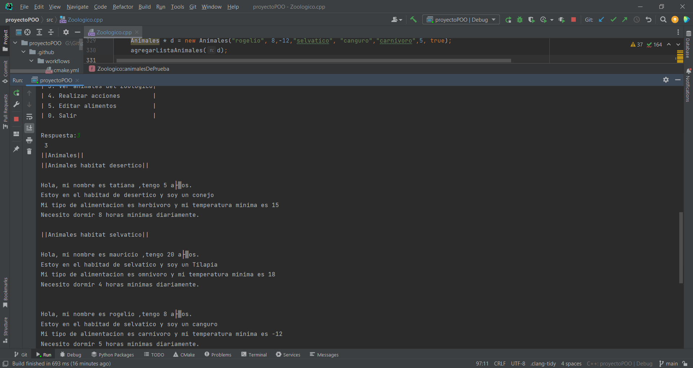
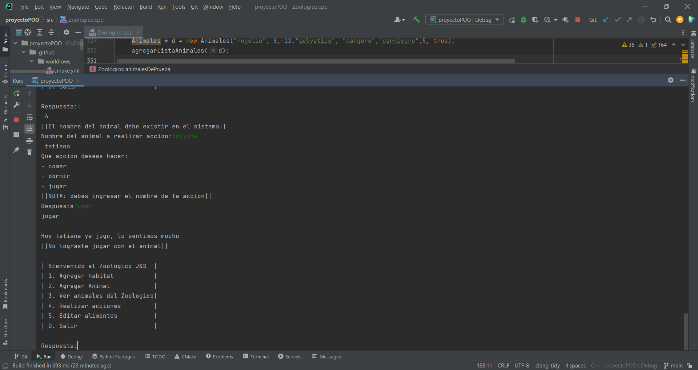
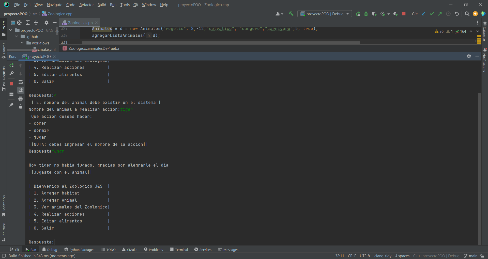
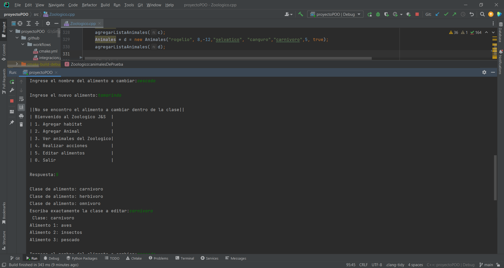

# Proyecto POO - Zoologico

### Presentacion

Mi proyecto esta basado en una modelacion de un Zoologico en programacion orientada a objetos en el lenguaje de c++, me base en hacer un modelamiento no muy complejo, en el programa implemente 5 opciones con el cual el usuario puede hacer diversa acciones, para este proceso tome clases como animales, habitas, alimentacion y entres otros. Me base en comportamientos como comer, dormir e jugar, estos comportamientos se le pueden simular a cada uno de los animales establecidos en el programa y tambien a los que se registran por el usuarios.

[Este es el diagrama UML del codigo](https://app.diagrams.net/#LDiagramas%20Zoologico.drawio).

### Explicacion de codigo

El codigo al ejecutarse mostrara un menu que esta compuesto por 6 opciones.

#### Opcion 1

Al oprimir esta opcion nos mostrara las habitas existentes, posteriormente, nos pedira el nombre del habitat que queremos agregar, pero solo podemos ingresar 4 habitas que son: desertico, selvatico, polar y acuatico, cualquiera que sea distinta de estas no se podra registrar, por otro lado si ingresamos el habitat faltante de esas 4 nombradas correctamente nos pedira una temperatura minima y maxima que maneje el habitat para los animales

### Opcion 2

Al ingresar la opcion 2 esta sera para registrar un animal al zoologico, este nos pedira primeramente el nombre del animal, dado que lo utilice en el programa como un identificador, por lo cual, cada animal tendra un nombre unico y en caso de que la persona ingrese un nombre existente en el zoologico se le volvera a preguntar hasta que sea distinto de los demas ya establecidos. Posteriormente, pedira la especie del animal si es un zorro, oso, etc. Continuamos con la temperatura que aceptable para el animal, dado que gracias a este dato podremos recomendarle a que habitat podria pertenecer el animal, ya ingresando el habitat recomendado y que sea correcto seguiremos con la clase de alimentacion del mismo, en esta parte en programa le mostrara los 3 tipos de clase de alimentacion que definimos con sus recpectivos alimentos, ya el usuario decide cual desea agregarle. Consecuente a esto nos pedira ingresar el minimo de horas diarias que debe dormir el animal, para de esta manera al momento de accionar con el podamos hacer que duerma las horas correspondientes, para finalizar pediremos la edad del animal y como requisito establecimos que no puede ser mayor de 26 años, asi que la edad a ingresar debe ser menor a 26 años o si no te preguntara de nuevo y finalmente se registrara el animal exitosamente.

### Opcion 3

Al ingresar la opcion 3, nos listara los animales cada uno en su respectiva habita, de hecho podemos ver el animal que anteriormente registramos que esta en el habita correspondiente y con sus respectivos datos.

### Opcion 4

Al ingresar la opcion 4, es para realizar las acciones con cada animal que queramos y que exista en nuestro zoologico, nos pedira siempre el nombre del animal dado que este es el identificador de cada uno, consecuente a esto verificara que exista el animal y mostrara el menu con las acciones que podremos realizar y cada accion tendra sus opciones y condiciones; lo mostraremos a continuacion en varios casos.

### Opcion 5

Al ingresar la opcion 5 nos mostrara un menu de las clases existentes de los alimentos, tendremos que elegir una de ella y escribirla exactamente para ser verificada, en caso de ser distinta se te notificara que la clase no existe y te devolvera al menu, posteriormente, se te mostraran los alimentos dentro de esa clase y elegiras uno para cambiar y se te pedira el nuevo alimento que deseas agregar, si ingresa el alimento que seleccionaste mal no se haran los cambios y se te notificara.

### Opcion 0

Al ingresar la opcion 0 sera para salir del programa y se te imprimira un mensaje de cortesia.

